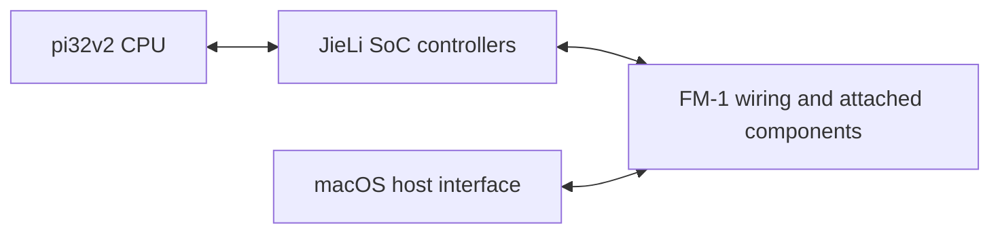

# Generic FM-1 QEMU architecture

Target macOS first. [plan.md](../plan.md) holds current work and
[BOOTING.md](BOOTING.md) holds runtime evidence; this file defines boundaries.

## Three layers

All layers share QEMU execution, address spaces and virtual clocks.
The SoC/board split is ownership within the hardware layer.

| Layer | Owns | Current location |
| --- | --- | --- |
| CPU | Registers, instructions, memory accesses, exceptions and IRQ entry/return | `overlay/target/pi32v2/` |
| Hardware | SoC controllers/shared routing; FM-1 board components and wiring | `overlay/hw/pi32v2/` |
| Host | Display, physical input, sample/MIDI transport and session controls | Existing Cocoa console; other adapters remain incomplete |

CPU semantics and implemented device maps never depend on firmware names,
hashes, symbols or guest PCs. Headless execution uses the same machine as
interactive execution. Host input must represent physical or transport events;
it must not edit guest variables. Felucca is an acceptance workload, not a
special CPU/device mode or the final compatibility boundary.

## Loading and observation

Architectural reset clears CPU state. Generic application handoff then maps
raw offset zero at `0x02000120`, sets r0=`0x01c7fe08`, and starts other registers
and SRAM at zero. The guest establishes stacks and initializes memory.
Erased 1 MiB NOR is seeded at physical `0x4120`; XIP maps physical `0x4000`
to `0x02000000`. This is an explicit application loader convention.

Omit `-append`, or use `-append application`, for generic handoff. Optional
fixture modes configure hashes, poisoning and observers in `fm1-test.c`.
They do not change execution semantics or available hardware. Observation
PCs and instruction budgets are test controls; observers are optional.
ROM/SPL, encrypted package and resident boot-ROM execution remain unsupported.
Having an ELF, update package or SDK loader does not prove those boot modes.

## Current hardware and execution contract

The shared map includes 512 KiB SRAM, NOR/SFC/SPI0, SPI1/LCD, GPIO/IOMAP,
TIMER4/5, protection/P33/watchdog, disconnected USB, ALNK0 and SAR/WLA.
Unimplemented accesses/configurations fault explicitly. IRQ11 and IRQ63 service
are implemented; nesting and equal-priority arbitration remain restricted.
One architectural instruction per translation block preserves current
predicate completion and IRQ boundaries; wider blocks require separate work.

Private SoC syscon owns CLK_CON1 `0x10010`, CLK_CON2 `0x10014` and IOMAP_CON5
`0x51030`. ALNK0 is a private resettable SysBus child at `0x12e00`; SAR owns
CON/RES at `0x13100`, and WLA owns `0x11900`. Local resets preserve unrelated
controllers and canonical shared words. Whole-machine/watchdog reset dispatch
is incomplete. Keep controller configuration register-driven.

Functional clocks and DMA completion captures are model policies, not measured
hardware timing. Active-buffer streaming, NOR program/erase persistence,
connected USB MIDI/CDC, UART and full-workload performance remain unverified.
USB's present scenario combines no host with an unavailable SIE clock.
CoreAudio/CoreMIDI and complete physical controls are not yet established.

## Provenance and compatibility

Maintain fresh GPL-2.0-or-later QEMU code using encoding/interface facts.
The GPL-3.0-only emulator is a separate optional reference executable, never
linked or copied into QEMU; see [LICENSES.md](LICENSES.md).
Do not read/change/rebuild Rust or firmware implementation sources or flash
hardware. Preserve public helper/capture/persistence contracts; changes need
explicit user authorization. Private observer instrumentation remains outside
production behavior.

The pinned unchanged Felucca application and diagnostic/display/foundation
artifacts are application-entry workloads. Stock raw applications, packages
and supplemental SDK inputs are compatibility candidates, not proven QEMU
workloads. Artifact identity does not establish source/build correspondence.
Full hashes and the input inventory remain in Git and the
[archived architecture inventory](/Users/simonjohansson/src/fm1-emulator/.deps/qemu-batch-d-2026-10-08/baseline/qemu-poc/ARCHITECTURE.md).
