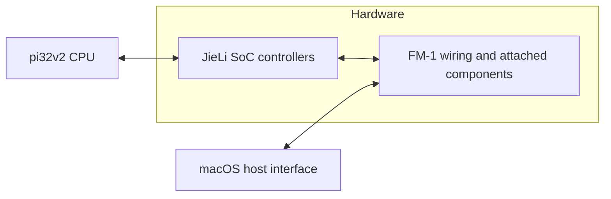

# FM-1 QEMU contracts and artifact inventory

Inspected on 2026-10-07. This records available inputs and the boundary work;
the ordered implementation and acceptance objectives remain in `../plan.md`.
Hashes below were read from the actual files. They establish artifact identity,
not correspondence to current source or a reproducible build. No firmware was
rebuilt, patched, flashed or executed for this inventory.

## Artifact inventory

Paths beginning `build/` or `tests/` below are relative to the QEMU worktree
`/Users/simonjohansson/src/fm1-qemu-poc`. `MAIN` means
`/Users/simonjohansson/src/fm1-emulator`; `FELUCCA` means
`/Users/simonjohansson/src/Felucca`. `.bin` entries are raw application images
unless explicitly identified as loaders. `.fwsc` entries are update packages,
not files the current QEMU raw-image loader can execute directly.

| Input | Bytes | SHA-256 | Established QEMU entry/use |
| --- | ---: | --- | --- |
| `build/probe.bin` | 142 | `b2eb46c63026c31d76df93430b1a950cac690f90647848d330af1232630cb8b5` | Application entry `0x02000120`; bounded probe |
| `build/foundation/firmware.bin` | 592 | `d22ba9de32a8ba3cfee7aec804468d7dea2db8a7c83d0c0707f996cbcfff8ac7` | Application entry; startup, matrix, RAM code and TIMER5. Timer subsection enters `0x02000238` |
| `tests/fixtures/display/firmware.bin` | 2,700 | `3bc59ff7d09de123174b49ea786582a1e137b2e1609074b5189c9fb024f19ba2` | Application entry; SPI/DMA display and physical matrix fixture |
| `build/fm1-diag.bin` | 14,804 | `781005cfcc4e0b562291fa747a0fa956204ee97c396c39214df04feaf86cc7e2` | Unchanged FM-1_980 application handoff; running diagnostic/disconnected USB retry |
| `FELUCCA/build/felucca.bin` | 417,668 | `12a4b4ea47248467f566ec3b6984b08f2f89d6ef5a8e9e494cab5184e8fadb36` | Pinned unchanged application; startup and splash, then first real IRQ11 entry; latest E86C failure after signed pre-indexed halfword support |
| `build/display/firmware.bin` | 17,056 | `ec7279a0d78bad1e511e147c854d91c4e72682f0c3842286615294043fc50dc0` | Separate full display application; not the 2,700-byte acceptance fixture |
| `build/fm1-diag.fwsc` | 609,649 | `5ed4ea26bef92218a07392ab374f226ae1bd69cb03c833ae5d5155c5274361e0` | Package available; package boot not established in QEMU |
| `build/display/firmware.fwsc` | 609,649 | `6c086e0c550ef1b418007bbc4bb33b3b767a6a4901fe6145a88eb3d1adf29d57` | Package available; package boot not established in QEMU |
| `FELUCCA/build/felucca-0.9-beta.fwsc` | 609,649 | `df98c0fe1317c092f0640667fd9db4e6cf417e86713546189b2c8845083b2883` | Package available; do not infer its contents from the raw filename |
| `MAIN/.deps/felucca-trial/felucca-0.9-beta.bin` | 581,564 | `5a00708f4988b6ecf31e1218f8e68235640c9f8a1cb8efb6d966a275d99843d2` | Older separate trial input; not the pinned QEMU Felucca |
| `MAIN/.deps/felucca-trial/felucca-0.9-beta.fwsc` | 609,649 | `320ef650a5c123becb46e749514f2b71c9ffa821a3fff8a515673cd9d21194a5` | Older separate package; no current QEMU acceptance claim |
| `MAIN/.deps/firmware-trial/felucca-profile/build/felucca.bin` | 418,300 | `cef142f6742e95af13ad924742ed67d0aec2b0f69bab8832cb060080498b0085` | Instrumented profile input; exclude from unchanged firmware acceptance |

The raw probe, foundation, diagnostic and pinned display have companion
32-bit little-endian ELF executables (machine identifier `0xf1`) and saved
disassemblies. The pinned Felucca ELF/disassembly also exist. Companion hashes:

```text
build/probe.elf
  0c6b78f995df3106856c5889af92e9641713cededd577fcfabcb71e12d3957f2
build/probe.dis
  e178f5ca951b3ffb9b0159a6faa718216ec2e8e7d97bdbfc9728d442ef4eb8ff
build/foundation/firmware.elf
  31a73717fef89577ee16f27abb58fa5fe3edba5bd7532f19cfcea3bf988b9423
build/foundation/firmware.dis
  207527b5bf6dd9a4703ea1f2ff0af18daa13c155e58c6b2749b6f534bbda11b7
tests/fixtures/display/firmware.elf
  929077b8a5e30e0ea19bbc3f800ac857906265acefc10f9f7ce42a366b525cbb
tests/fixtures/display/firmware.dis
  ce82aa5c8e459761019a4782510ee74711d8246c51541d2299ab489f7ad5875f
build/fm1-diag.elf
  aaa5c1bfaf3f42ea645d8bd5528d8e7e804a6fc04a4134329be203a0eaa9ec70
build/fm1-diag.dis
  c7e14d50882ac2a9878f5b4d2c81e01cdee594ce2c070aa699d70d03fd8f71d3
FELUCCA/build/felucca.elf
  9404c41dcd5c7516243e99cdbae1a4e731ea0c69e13dea397a8db343244b5deb
FELUCCA/build/felucca.dis
  0d992c3113a1765f21a10bfb233bef81ee908073f26a16ea1f9d13c6fe897618
```

The established Felucca validator checks file-backed ELF load segments against
the raw application. This is not source/build attribution. QEMU currently
executes raw images; having an ELF companion does not establish ELF import.

### Stock and other unchanged packages

| Input | Bytes | SHA-256 |
| --- | ---: | --- |
| `/Users/simonjohansson/Downloads/FM-1.fwsc` | 699,956 | `db1642b2b6fa5c2cccb11ffd13878068bb28601678d3644049f99dc40e7edb8a` |
| `/Users/simonjohansson/Downloads/FM-1_093.fwsc` | 810,548 | `ac69c2cd070a5fa606fb4170f190fee0aa593f73e8fdc58b638ac89269e39b48` |
| `MAIN/.deps/firmware-trial/FM-1/app.bin` | 581,564 | `306e47065f35d7a7a05ada7f5dd092f6e770952054f33f0a86b75fd10ffe3203` |
| `MAIN/.deps/firmware-trial/FM-1_093/app.bin` | 692,480 | `4dd80425cbd4713d9183c1b161001e0e60fdf1879372d37c6302433d5cb20112` |

Existing public input documentation at `MAIN/rust-emulator/STOCK-FIRMWARE.md`
and saved extraction metadata identify these as official FM-1_015 and Baud
Girl FM-1_093. They describe application-entry loading at `0x02000120`, a flash
application area at `0x4000`, package directories/key/configuration and separate
factory preset payloads. An extracted raw application loses those other inputs.
The documented Baud Girl auxiliary preset integrity failure must remain visible;
do not substitute another package's data. These are compatibility candidates,
not established QEMU workloads. Neither full ROM/SPL boot nor dual-core QEMU
execution is established by those separate-emulator trials.

### Supplemental diagnostics

The following raw applications, with companion ELF/disassembly/update package
files, exist under `MAIN/.deps/firmware-trial/<directory>/build/`. They are local
diagnostic artifacts, not additional production-firmware compatibility results.
Their linker/startup convention must be verified before assigning a QEMU boot
contract; no hardware actions are authorized by their presence.

| Directory / raw filename | Bytes | SHA-256 |
| --- | ---: | --- |
| `arithmetic/fm1-arithmetic.bin` | 15,560 | `431a583a325d416a6fa3c89b2232b8d0a4589a6a4694728c8875e6dbabc1ee7b` |
| `atomic/fm1-atomic.bin` | 16,228 | `ba6639aa56a5142e3e9551d20aa64c4266197ccef6515762f19eff58b10313b1` |
| `bt-indirect/fm1-bt-indirect.bin` | 15,592 | `01ed88908de67a4c1c5683257a8281d6b2f7e2a0382112c61a226eafd12008e7` |
| `float-branch/fm1-float-probe.bin` | 15,580 | `012585320a0e045d8f8d7d2cd03dfad8266630291ef237128e3892b2e7aab3c0` |
| `float-probe/fm1-float-probe.bin` | 17,236 | `0848bb8b614283037b3619aed7140f284b0bec5631739072ca68830a3392652b` |
| `idle/fm1-idle.bin` | 15,344 | `a3e2dcb856bb7e0b7b5de31eb587f604705a709dc33ca84a94607bb900c41b5c` |
| `irq-context/fm1-irq-context.bin` | 15,364 | `48619b404143af38f12c5c8800d259b3607cd3869f79bf8f22be660872678c05` |
| `predicate-irq/fm1-predicate-irq.bin` | 15,196 | `ae7383d06d3f826dad4151cf343a0fa6b5a17dac5a42903d8a30bc39736a1555` |
| `repeat/fm1-repeat.bin` | 15,308 | `d03f2bfb482521d51dce05ea4814c72fc7c646af992f0b9c479cf6641be6e099` |
| `repeat-irq/fm1-repeat-irq.bin` | 15,176 | `d52d277655bdd27d202c49cb0985fd0dc64e5f722a944d58abd4a1b14e004c60` |
| `rf-probe/fm1-rf-probe.bin` | 15,788 | `8f52fcc2f30807d9145529f07e3e982541e4a8cb4a5833d1c07c7ee5ee04550f` |
| `temperature/fm1-temperature-probe.bin` | 15,148 | `709e2b0372b3190dce9d1c8507c97d23b32411bf81054d28fbd13a3b3eff297b` |
| `usb-io/fm1-usb-io.bin` | 15,052 | `bac312198ca99301750429c64fdb4b6b332bc73f56656e63182ae7731627e2e5` |

Local update-loader artifacts also exist: `build/loader/loader.bin` is 7,736
bytes, SHA-256 `e240f1ea5aa011748157afd87584acdca9174e8eef4c973e6f5361b4e5431d8b`;
`build/loader/ota.bin` is 6,493 bytes, SHA-256
`cc98eed224299fa42ca22a546073e0f8b98d8362e26b5f325a9aaeab287bdf5d`.
The linker describes a RAM image at `0x01c0a800`, with separate stacks. These
are not boot ROM replacements and have not been executed in QEMU. SDK loaders
are development/update tools, not evidence of the synth's resident boot ROM.

## Boot and observation contracts

- **Raw application handoff:** raw offset zero maps to `0x02000120`; seed erased
  1 MiB NOR at physical offset `0x4120`, with XIP mapping physical `0x4000` to
  `0x02000000`. This is a documented loader convention, not hardware reset.
  Diagnostic/Felucca handoff supplies `r0 = 0x01c7fe08`; guest startup establishes
  its own stacks and memory. The tiny timer subsection has an explicit separate
  entry and stack seed. Architectural CPU reset must not infer any of these
  values from a firmware name.
- **Cold validation memory:** diagnostic/Felucca test profiles retain their
  hash-bound poisoned startup sections and zero noinit/loader state. Foundation
  poisons all SRAM. These are observer/loader test inputs, not SoC reset values.
- **Hardware boot:** unsupported. It requires identified ROM, flash/storage,
  reset/vector and encryption inputs. Update packages and loaders alone do not
  establish this contract.
- **Optional observers:** fixture names, hashes, checkpoint PCs and guest-symbol
  reads belong to validation. They may configure observation and explicit loader
  inputs, but must not select ISA semantics, peripheral availability or maps.
  Keep existing recorded output formats during extraction.

## Layer ownership and current hardware contract

The CPU owns architecture and instruction execution. The reusable JieLi SoC
owns SRAM/address decoding, protection, controllers, shared clock/pinmux words
and interrupt routing. The FM-1 board owns the LCD, NOR component and physical
matrix/shift-register/analog/audio connections. Host code consumes modeled
pixels/PCM and supplies physical or transport events. Removing the viewer must
leave the same guest hardware and device timing.

Stage 2 uses the same evidenced controller-map superset for every image:
512 KiB SRAM at `0x01c00000`; XIP/SFC/SPI0/NOR; SPI1/LCD; GPIO and IOMAP;
TIMER4/5; protection/P33/watchdog; disconnected USB; ALNK0; and supported IRQ
configuration registers. Unsupported configurations remain explicit faults.
ALNK0's dedicated model owns `0x12e00` for all images. Its cold CON0 read/write
of zero covers the diagnostic's old disabled model without a second overlapping
mapping in system registers.

`validate_machine_profiles.py` exercises identical initialized MMIO programs
under probe, diagnostic, ALNK-probe and generic application observers. It moves
the code and renames identical-byte images, compares actual guest readbacks,
and checks unsupported access faults. This gate does not establish further
production firmware or all possible controller configurations.

The syscon component now owns exactly three canonical words: CLK_CON1 at
`0x10010` (mask `0x3`), CLK_CON2 at `0x10014` (mask `0xf00`) and IOMAP_CON5 at
`0x51030` (mask `0xc0`). SoC composition maps each existing four-byte region.
ALNK uses getters and precommit validators for active clock/routing changes;
USB has no duplicate selector storage. Existing widths, names, faults and
functional rates remain unchanged. `validate_syscon.py` covers 28 cases,
including rejected writes before canonical assignment and preserved active
ALNK phase/pending/samples. This is ownership extraction, not clock-tree or
reset support; local ALNK reset is recorded below.

ALNK is now a composition-owned private SysBus child, with the same MMIO
address, widths, rates and IRQ connector. Resettable enter cancels local work
and clears ALNK registers/capture history; hold lowers its IRQ. Canonical
syscon words, SRAM, CPU and unrelated controllers remain intact. Unrealize
clears only its owned validators and finalization frees its one timer.
`validate_alnk_reset.py` passes 18 cases with test-only virtual-time injection
and separate pre/post sidecars. Actual pending TIMER5 delivery/ack/RTI survives.
At fixed CPU revision 0ba8792, complete captured firmware state, SRAM, samples
and LCD bytes match before/after within fixture and generic modes. Local reset
is model validation; physical/whole-machine/watchdog reset and runtime
unrealize/re-realize are unvalidated. Existing capture schemas stay unchanged.

Known gaps remain: fixed functional timer/SPI/audio clocks rather than an
evidenced clock tree; whole-transfer/half DMA capture assuming stable buffers;
unvalidated skipped-callback captures; no persistent NOR program/erase; remaining
controller lifecycles and hardware reset dispatch; only IRQ11/63 selection,
without nesting/equal-priority arbitration; no ADC, UART or connected USB
MIDI/CDC; no validated audio endpoint or CoreAudio playback. The current USB
scenario combines no host and unavailable SIE clock; it proves guest retry,
not that cable absence necessarily disables SIE register access. Shared clock
and routing words now use one private SoC syscon owner; other words and a
clock tree remain unimplemented.

Use register/encoding/interface facts and fresh GPL-2.0-or-later implementation.
Keep the GPL-3.0-only Rust reference in a separate executable through its public
interfaces. See `LICENSES.md` for the provenance boundary.

## Implemented first boundary milestone (2026-10-07)



All three layers use QEMU's memory, virtual clocks and execution context.
The SoC/board split is ownership within the hardware layer; extracting the
remaining combined controllers and reset lifecycle is the next stage.

- `overlay/target/pi32v2/` no longer contains firmware profile flags, seeded
  test registers or named FM-1 callbacks. Hardware hooks and optional observers
  have separate interfaces. CPU reset clears state before applying explicit
  loader inputs. Existing vector-base/source/nesting limitations remain.
- `overlay/hw/pi32v2/fm1-poc.c` constructs the same implemented map for all
  images. Guard, stack, XIP and branch-trace behavior follows device state even
  with observers disabled. `fm1-system.c` no longer carries a second disabled
  ALNK implementation.
- `overlay/hw/pi32v2/fm1-test.c` holds optional fixture configuration, poisoned
  test memory, observations and captures; `fm1-poc.h` is private shared state.
  Existing fixture names remain test entry points. The loader has not yet been
  extracted into a separate reusable image-format component.
- Every image now uses the same conditional-completion path and a one-guest-
  instruction translation-block boundary. This deliberately removes the tiny
  probe's previous multi-instruction blocks; the structural infrastructure
  check now verifies the shared correctness boundary. No throughput gain or
  preservation is claimed. Wider blocks require separate correctness and
  representative performance gates.

### Generic raw application execution

Run from the QEMU worktree after its existing mise-managed build:

```sh
qemu-poc/.cache/build/qemu-system-pi32v2 \
  -M fm1-poc -accel tcg,thread=single \
  -icount shift=3,align=off,sleep=off \
  -display none -serial none -monitor none -nodefaults \
  -kernel /absolute/path/to/application.bin
```

Omitting `-append`, or explicitly selecting `-append application`, uses the
same raw application handoff. It sets PC `0x02000120`, r0 `0x01c7fe08`, other
registers and SRAM to zero, and routes XIP to the erased-and-seeded board NOR.
The guest sets its own stacks. There are no filename/hash requirements,
poisoned sections, implicit stop PCs or instruction budgets in this mode.
This convention is not a claim about architectural power-on register values.

Optional `FM1_POC_MAX_INSTRUCTIONS`, `FM1_POC_STOP_PC` and
`FM1_POC_STATE_DIR` enable bounded observation/capture; the state directory
must exist. Without these, the generic application installs no observers.
The fixed instruction-to-time ratio is a controlled functional test clock,
not a real-time or hardware-cycle calibration.

The new CPU gate covers 88 initialized profile/layout cases and ten default
application cases with observers disabled, including self-checked register
handoff, conditionals/calls and guard/XIP faults. The machine gate covers 32
common-map cases with two code layouts and renamed identical-byte inputs.
Pending IRQ admission exactly at a conditional-arm boundary and page-crossing
conditional arms are not newly covered by these gates; retain those as
specific follow-up tests before changing predicate/TB scheduling.
